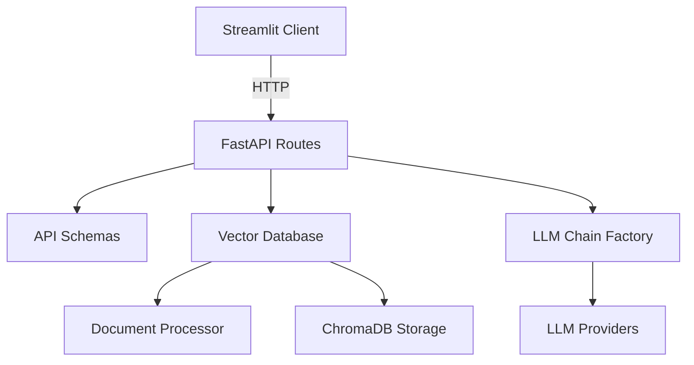
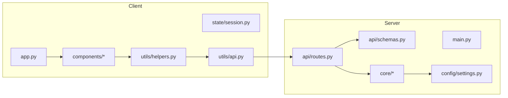

# RAG PDFBot 项目框架分析报告

## 1. 项目概述
- 类型：全栈应用（Streamlit 前端 + FastAPI 后端）
- 技术栈：FastAPI、Streamlit、LangChain、ChromaDB、PyPDF、HuggingFace Embeddings、Google GenAI Embeddings
- 结构：前后端分离，API 驱动交互，核心逻辑集中在 `server/core/`

## 2. 架构分析
- 架构模式：客户端-服务器 + 前后端分离
- 主要层次：
  - 前端层：`client/`（Streamlit UI + 会话状态 + API 调用封装）
  - 后端层：`server/`（FastAPI 路由 + 核心业务逻辑 + 向量库）
  - 基础设施：本地文件系统（PDF 临时存储）、ChromaDB 持久化
- 通信方式：HTTP REST API

## 3. 功能模块列表

### 客户端（`client/`）
- 入口：`client/app.py`
  - 负责页面初始化、主页面渲染与侧边栏配置
- 组件层：
  - `client/components/chat.py`：聊天输入、聊天历史、下载历史
  - `client/components/sidebar.py`：模型选择、上传 PDF、工具按钮
- 状态管理：
  - `client/state/session.py`：会话状态初始化与判定
- API 封装：
  - `client/utils/api.py`：直接调用后端 API
  - `client/utils/helpers.py`：高层封装（给组件调用）
  - `client/utils/config.py`：`API_URL` 配置

### 服务端（`server/`）
- 入口：`server/main.py`
  - FastAPI 启动与路由挂载
  - 启动时初始化向量库
- API 层：
  - `server/api/routes.py`：所有 HTTP 路由
  - `server/api/schemas.py`：请求/响应模型
- 核心逻辑层：
  - `server/core/document_processor.py`：PDF 校验、保存、拆分
  - `server/core/vector_database.py`：向量库管理、嵌入、检索
  - `server/core/llm_chain_factory.py`：构建 LLM + Retriever Chain
- 配置层：
  - `server/config/settings.py`：API Key、模型选项、存储路径
- 工具层：
  - `server/utils/logger.py`：日志

## 4. 数据与控制流（端到端）
1. 前端选择模型 + 上传 PDF → `client/components/sidebar.py`
2. 前端调用 `client/utils/helpers.py` → `client/utils/api.py`
3. 后端路由 `POST /upload_and_process_pdfs` → `server/api/routes.py`
4. PDF 保存/拆分 → `server/core/document_processor.py`
5. 嵌入 + Chroma 持久化 → `server/core/vector_database.py`
6. 用户提问 → `POST /chat`
7. 构建 LLM Chain → `server/core/llm_chain_factory.py`
8. 返回结果 → 前端渲染在 `client/components/chat.py`

## 5. API 端点
- `/health`
- `/llm`
- `/llm/{provider}`
- `/upload_and_process_pdfs`
- `/vector_store/count/{provider}`
- `/vector_store/search`
- `/chat`

## 6. 模块关系图（Mermaid）

## 7. 系统架构图（Mermaid）

